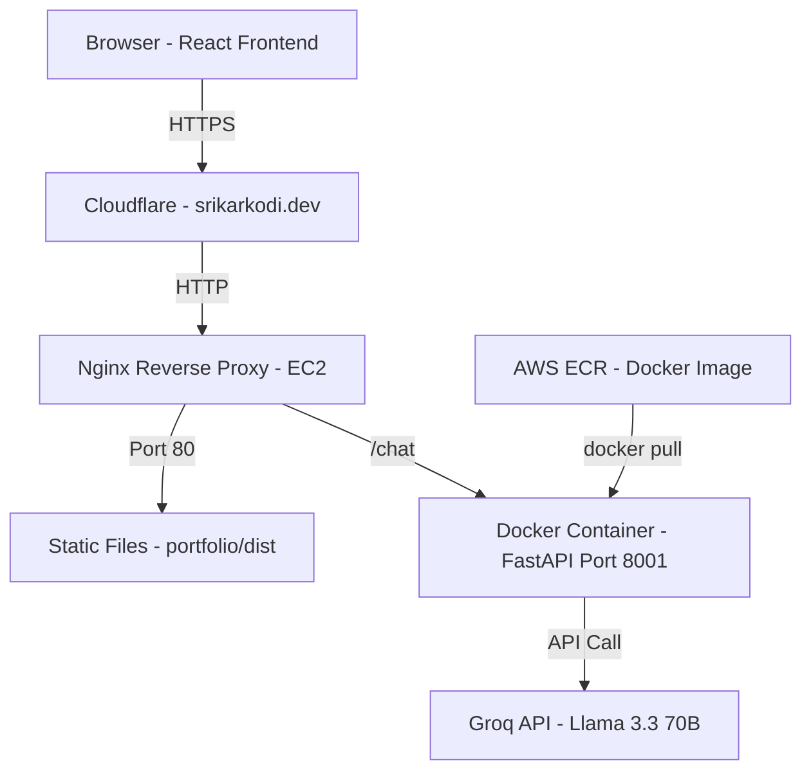
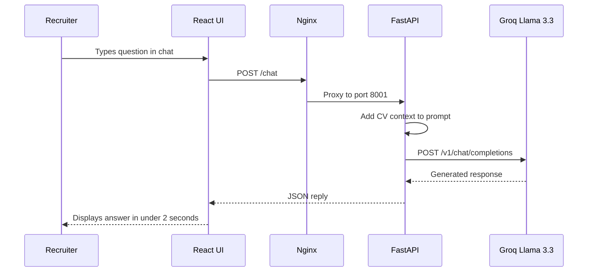
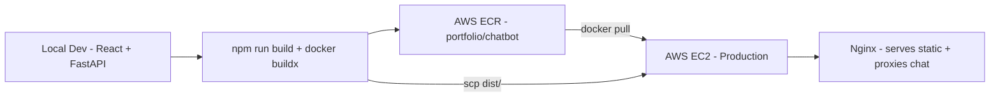

# Srikar Kodi — Portfolio
### srikarkodi.dev

> A production-grade personal portfolio with an AI-powered recruiter assistant. Built with React, FastAPI, Groq API, Docker, and AWS EC2.

---

## 🌐 Live

| App | URL |
|-----|-----|
| Portfolio | [srikarkodi.dev](http://srikarkodi.dev) |
| SkillSync | [skillsync.srikarkodi.dev](http://skillsync.srikarkodi.dev) |
| CoverCraft | [covercraft.srikarkodi.dev](http://covercraft.srikarkodi.dev) |

---

## 🏗️ System Architecture



---

## 🤖 AI Chatbot Flow



---

## 🚀 Deployment Pipeline



---

## 🛠️ Tech Stack

| Layer | Technology | Purpose |
|-------|-----------|---------|
| Frontend | React 18, Vite, Tailwind CSS | UI framework |
| Animations | CSS transitions, Canvas API | Particle background, typewriter |
| Chatbot UI | React hooks, Fetch API | Chat interface |
| Chatbot Backend | Python, FastAPI | REST API server |
| AI Model | Llama 3.3 70B via Groq | Natural language responses |
| Containerisation | Docker, AWS ECR | Backend packaging |
| Server | AWS EC2 t3.micro | Compute |
| Web Server | Nginx | Static serving + reverse proxy |
| DNS | Cloudflare | Domain + DDoS protection |
| Fixed IP | AWS Elastic IP 3.228.77.181 | Permanent server address |

---

## ✨ Features

### Portfolio UI
- **CRED-inspired dark theme** — near-black background with gold accents
- **Constellation particle background** — 80 particles with mouse-reactive connections
- **Typewriter hero animation** — cycles through 4 roles at 80ms per character
- **DE/EN language toggle** — full German translation across all sections
- **Smooth scroll reveals** — Intersection Observer API on every section
- **Responsive design** — mobile, tablet, desktop

### AI Chatbot
- **Auto-opens after 5 seconds** with a greeting message
- **Pulsing gold glow** — draws attention without being annoying
- **Animated bounce bubble** — "Ask me anything!" above the button
- **Suggested questions** — 4 pre-built recruiter questions on first open
- **Full CV as context** — knows every detail of Srikar's profile
- **Answers in the user's language** — EN or DE automatically detected
- **Sub-2 second responses** — Groq's LPU inference engine

---

## 📁 Project Structure

```
SrikarKodi_Portfolio/
├── src/
│   ├── components/
│   │   ├── Navbar.jsx              Sticky navbar with DE/EN toggle
│   │   ├── Chatbot.jsx             AI chatbot with auto-open and suggestions
│   │   └── ParticleBackground.jsx  Canvas constellation animation
│   ├── sections/
│   │   ├── Hero.jsx                Typewriter animation + CTA buttons
│   │   ├── About.jsx               Bio, experience, education timeline
│   │   ├── Projects.jsx            4 project cards with live/building/upcoming
│   │   ├── Skills.jsx              Skills grouped by category
│   │   └── Contact.jsx             Contact form + social links
│   ├── hooks/
│   │   ├── useScrollFade.js        Intersection Observer scroll animations
│   │   ├── useLang.jsx             DE/EN language context provider
│   │   └── useTracker.js           Visitor tracking hook
│   └── data/
│       └── portfolio.js            All content in EN + DE translations
├── backend/
│   ├── main.py                     FastAPI endpoints - /chat /track /analytics
│   ├── requirements.txt            Python deps with pinned versions
│   ├── Dockerfile                  python:3.11-slim image
│   └── .dockerignore
├── public/
│   └── SrikarKodi-CV.pdf           Downloadable CV
└── dist/                           Production build served by Nginx
```

---

## 🔧 Running Locally

### Frontend
```bash
git clone https://github.com/Namidok/SrikarKodi_Portfolio.git
cd SrikarKodi_Portfolio
npm install
npm run dev
# Opens at http://localhost:5173
```

### Chatbot Backend
```bash
cd backend
python3.11 -m venv venv
source venv/bin/activate
pip install -r requirements.txt

echo "GROQ_API_KEY=your_key_here" > .env

./venv/bin/uvicorn main:app --host 0.0.0.0 --port 8001
# Health check at http://localhost:8001/health
```

> Get a free Groq API key at [console.groq.com](https://console.groq.com)

---

## 📊 Visitor Analytics

Self-built analytics — no third-party tracking.

```bash
curl http://srikarkodi.dev/analytics?key=srikar2026
```

Returns total visits, unique IPs, visits by day, visits by language, recent 20 visitors.

---

## 🐳 Docker Commands

```bash
# Build for Linux AMD64 and push to ECR
docker buildx build --platform linux/amd64 \
  -t 830673476818.dkr.ecr.us-east-1.amazonaws.com/portfolio/chatbot:latest \
  --push .

# On EC2 - pull and run
docker pull 830673476818.dkr.ecr.us-east-1.amazonaws.com/portfolio/chatbot:latest

docker run -d \
  --name portfolio-chatbot \
  --restart always \
  -p 8001:8001 \
  -e GROQ_API_KEY=your_key \
  830673476818.dkr.ecr.us-east-1.amazonaws.com/portfolio/chatbot:latest
```

---

## 🔄 Redeployment

```bash
# Update frontend
npm run build
scp -i ~/skillsync-key.pem -r dist ubuntu@3.228.77.181:/home/ubuntu/portfolio/

# Update chatbot backend
docker buildx build --platform linux/amd64 \
  -t 830673476818.dkr.ecr.us-east-1.amazonaws.com/portfolio/chatbot:latest --push .

# On EC2
docker stop portfolio-chatbot && docker rm portfolio-chatbot
docker pull 830673476818.dkr.ecr.us-east-1.amazonaws.com/portfolio/chatbot:latest
docker run -d --name portfolio-chatbot --restart always -p 8001:8001 \
  -e GROQ_API_KEY=your_key \
  830673476818.dkr.ecr.us-east-1.amazonaws.com/portfolio/chatbot:latest
```

---

*Built by Srikar Kodi · MSc AI/ML · Berlin · 2026*