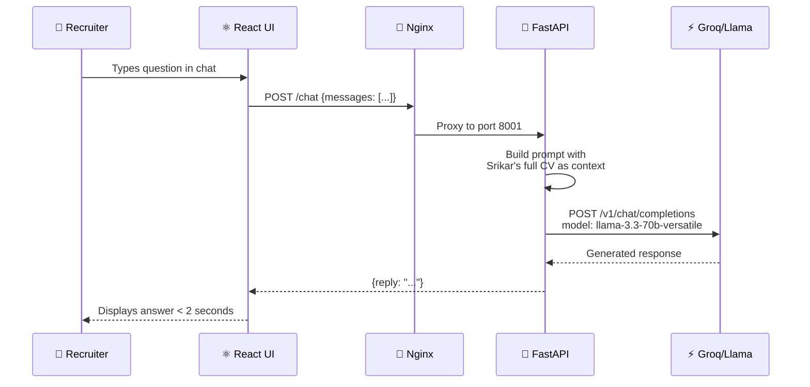
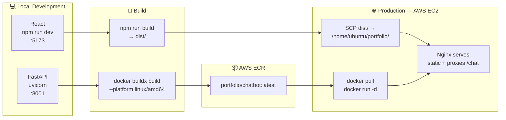

# Srikar Kodi — Portfolio
### srikarkodi.dev

> A production-grade personal portfolio with an AI-powered recruiter assistant. Built with React, FastAPI, Groq API, Docker, and AWS EC2.

---

## 🌐 Live

| App | URL |
|-----|-----|
| Portfolio | [srikarkodi.dev](http://srikarkodi.dev) |
| SkillSync | [skillsync.srikarkodi.dev](http://skillsync.srikarkodi.dev) |
| CoverCraft | [covercraft.srikarkodi.dev](http://covercraft.srikarkodi.dev) |

---

## 🏗️ System Architecture

```mermaid
graph TB
    subgraph Client["🌍 Client (Browser)"]
        A[React Frontend<br/>Vite + Tailwind CSS]
    end

    subgraph Cloudflare["☁️ Cloudflare CDN"]
        CF[DNS + DDoS Protection<br/>srikarkodi.dev]
    end

    subgraph EC2["🖥️ AWS EC2 t3.micro — 3.228.77.181"]
        subgraph Nginx["Nginx Reverse Proxy"]
            N1[Port 80 → Portfolio React]
            N2[/chat → Port 8001]
        end

        subgraph Docker["🐳 Docker Container"]
            D1[Portfolio Chatbot API<br/>FastAPI · Port 8001]
        end

        subgraph Static["📁 Static Files"]
            S1[/home/ubuntu/portfolio/dist]
        end
    end

    subgraph Groq["⚡ Groq Cloud API"]
        G1[Llama 3.3 70B<br/>Free Tier · 14,400 req/day]
    end

    subgraph ECR["🗄️ AWS ECR"]
        E1[portfolio/chatbot:latest<br/>Docker Image]
    end

    A -->|HTTPS| CF
    CF -->|HTTP| Nginx
    N1 --> S1
    N2 --> D1
    D1 -->|API Call| G1
    E1 -->|docker pull| D1
```

---

## 🤖 AI Chatbot Flow



---

## 🚀 Deployment Pipeline



---

## 🛠️ Tech Stack

| Layer | Technology | Purpose |
|-------|-----------|---------|
| Frontend | React 18, Vite, Tailwind CSS | UI framework |
| Animations | CSS transitions, Canvas API | Particle background, typewriter |
| Chatbot UI | React hooks, Fetch API | Chat interface |
| Chatbot Backend | Python, FastAPI | REST API server |
| AI Model | Llama 3.3 70B via Groq | Natural language responses |
| Containerisation | Docker, AWS ECR | Backend packaging |
| Server | AWS EC2 t3.micro | Compute |
| Web Server | Nginx | Static serving + reverse proxy |
| DNS | Cloudflare | Domain + DDoS protection |
| Fixed IP | AWS Elastic IP | Permanent server address |

---

## ✨ Features

### Portfolio UI
- **CRED-inspired dark theme** — near-black background with gold accents
- **Constellation particle background** — 80 particles with mouse-reactive connections
- **Typewriter hero animation** — cycles through 4 roles at 80ms/character
- **DE/EN language toggle** — full German translation across all sections
- **Smooth scroll reveals** — Intersection Observer API on every section
- **Responsive design** — mobile, tablet, desktop

### AI Chatbot
- **Auto-opens after 5 seconds** with a greeting message
- **Pulsing gold glow** — never stops drawing attention
- **Animated bounce bubble** — "Ask me anything!" above the button
- **Suggested questions** — 4 pre-built recruiter questions
- **Full CV as context** — knows every detail of Srikar's profile
- **Answers in the user's language** — EN or DE automatically
- **Sub-2 second responses** — Groq's LPU inference engine

---

## 📁 Project Structure

```
SrikarKodi_Portfolio/
├── src/
│   ├── components/
│   │   ├── Navbar.jsx          # Fixed navbar with scroll effect + DE/EN toggle
│   │   ├── Chatbot.jsx         # AI chatbot UI — auto-open, suggestions, typing
│   │   └── ParticleBackground.jsx  # Canvas constellation animation
│   ├── sections/
│   │   ├── Hero.jsx            # Typewriter + CTA buttons
│   │   ├── About.jsx           # Bio + experience + education
│   │   ├── Projects.jsx        # 4 project cards with live/building/upcoming
│   │   ├── Skills.jsx          # Skills grouped by category
│   │   └── Contact.jsx         # Contact form + social links
│   ├── hooks/
│   │   ├── useScrollFade.js    # Intersection Observer scroll animations
│   │   ├── useLang.jsx         # DE/EN language context
│   │   └── useTracker.js       # Visitor tracking
│   └── data/
│       └── portfolio.js        # Single source of truth — all content in EN + DE
├── backend/
│   ├── main.py                 # FastAPI — /chat, /track, /analytics, /health
│   ├── requirements.txt        # Python deps — pinned versions
│   ├── Dockerfile              # python:3.11-slim, port 8002
│   └── .dockerignore
├── public/
│   └── SrikarKodi-CV.pdf       # Downloadable CV
└── dist/                       # Production build — served by Nginx
```

---

## 🔧 Running Locally

### Frontend
```bash
git clone https://github.com/Namidok/SrikarKodi_Portfolio.git
cd SrikarKodi_Portfolio
npm install
npm run dev
# → http://localhost:5173
```

### Chatbot Backend
```bash
cd backend
python3.11 -m venv venv
source venv/bin/activate
pip install -r requirements.txt

# Create .env
echo "GROQ_API_KEY=your_key_here" > .env

./venv/bin/uvicorn main:app --host 0.0.0.0 --port 8001
# → http://localhost:8001/health
```

> Get a free Groq API key at [console.groq.com](https://console.groq.com)

---

## 📊 Visitor Analytics

Self-built analytics endpoint — no third-party tracking.

```bash
# View analytics (requires key)
curl http://srikarkodi.dev/analytics?key=srikar2026
```

Returns: total visits, unique IPs, visits by day, visits by language, recent 20 visitors.

---

## 🐳 Docker Deployment

```bash
# Build for Linux AMD64 (EC2 architecture)
docker buildx build --platform linux/amd64 \
  -t 830673476818.dkr.ecr.us-east-1.amazonaws.com/portfolio/chatbot:latest \
  --push .

# On EC2 — pull and run
docker pull 830673476818.dkr.ecr.us-east-1.amazonaws.com/portfolio/chatbot:latest
docker run -d \
  --name portfolio-chatbot \
  --restart always \
  -p 8001:8001 \
  -e GROQ_API_KEY=your_key \
  830673476818.dkr.ecr.us-east-1.amazonaws.com/portfolio/chatbot:latest
```

---

## 🔄 Redeployment

### Update frontend
```bash
npm run build
scp -i ~/skillsync-key.pem -r dist ubuntu@3.228.77.181:/home/ubuntu/portfolio/
```

### Update chatbot backend
```bash
# Mac — rebuild and push
docker buildx build --platform linux/amd64 \
  -t 830673476818.dkr.ecr.us-east-1.amazonaws.com/portfolio/chatbot:latest --push .

# EC2 — pull and restart
docker pull 830673476818.dkr.ecr.us-east-1.amazonaws.com/portfolio/chatbot:latest
docker stop portfolio-chatbot && docker rm portfolio-chatbot
docker run -d --name portfolio-chatbot --restart always -p 8001:8001 \
  -e GROQ_API_KEY=your_key \
  830673476818.dkr.ecr.us-east-1.amazonaws.com/portfolio/chatbot:latest
```

---

*Built by Srikar Kodi · MSc AI/ML · Berlin · 2026*